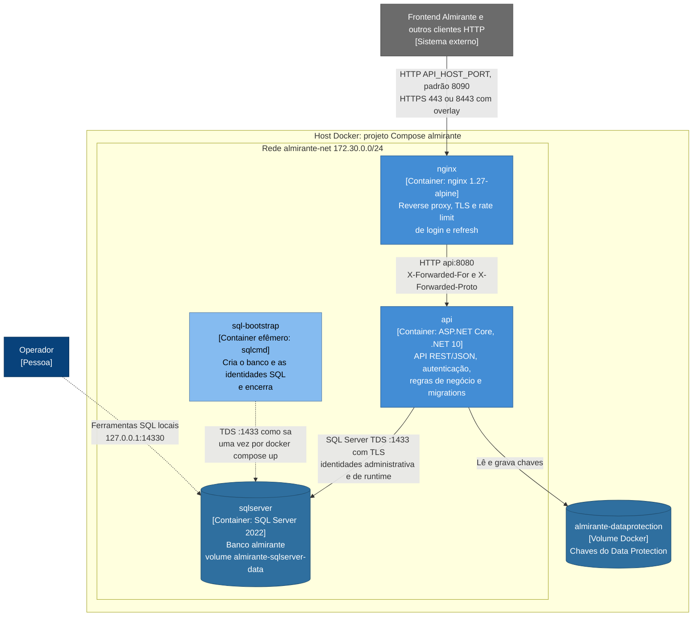
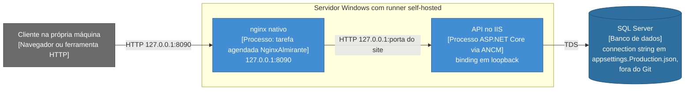
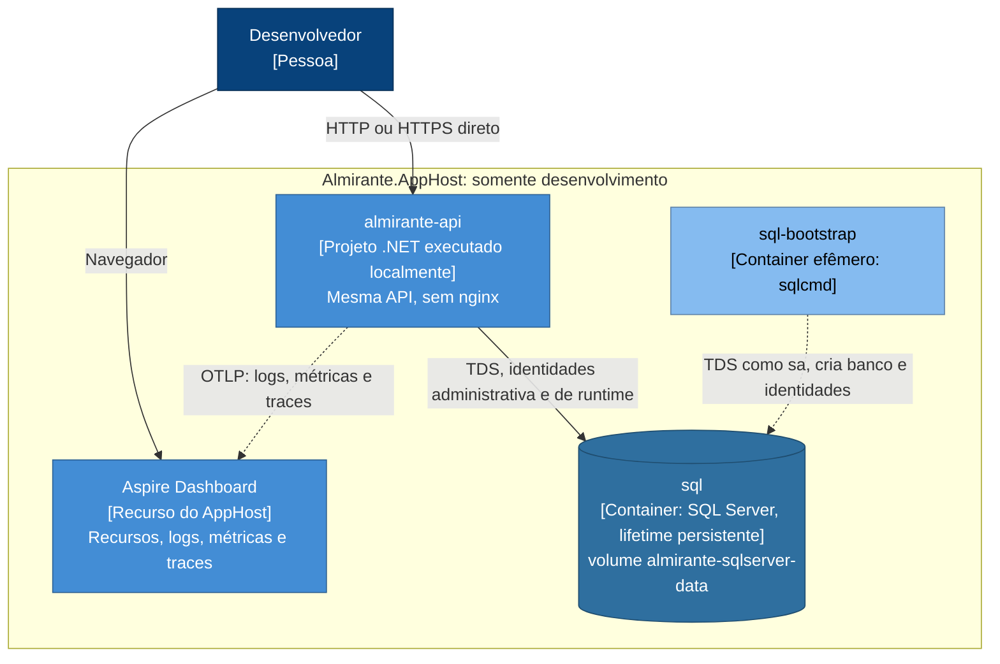

# C4: containers

Este documento abre a caixa do [contexto](c4-context.md) e mostra os containers do Almirante Backend:
as unidades que executam ou armazenam dados separadamente (processos, containers Docker e bancos). É
o nível 2 do modelo C4.

Retrato do commit `57f24dd` da `main`, levantado em 2026-09-23.

O sistema roda em três topologias diferentes. Elas são mostradas separadamente para não misturar o
que é deploy com o que é desenvolvimento:

| Topologia | Uso | Definida em |
| --- | --- | --- |
| [Docker Compose](#topologia-1-docker-compose) | deploy Linux (`deploy-linux`) e execução local | [`compose.yaml`](../../compose.yaml), [`compose.https.yaml`](../../compose.https.yaml), [`compose.tls.yaml`](../../compose.tls.yaml) |
| [Windows/IIS](#topologia-2-windowsiis) | deploy Windows (`deploy-windows`), acessível só pela própria máquina | [`backend-deploy.yml`](../../.github/workflows/backend-deploy.yml), [`nginx/nginx.windows.conf`](../../nginx/nginx.windows.conf) |
| [.NET Aspire](#topologia-3-net-aspire-desenvolvimento) | somente desenvolvimento local | [`AppHost.cs`](../../backend/Almirante.AppHost/AppHost.cs) |

## Projetos .NET e containers

Projeto .NET não é sinônimo de container. A solução
[`Almirante.slnx`](../../backend/Almirante.slnx) tem quatro projetos:

| Projeto | O que é em runtime |
| --- | --- |
| `Almirante.Api` | O container **API**. É o único projeto publicado (imagem Docker ou `dotnet publish` no IIS). |
| `Almirante.ServiceDefaults` | Biblioteca compilada dentro da API: OpenTelemetry, health checks, service discovery e resiliência de `HttpClient`. Não é um processo separado. |
| `Almirante.AppHost` | Orquestrador do .NET Aspire. Roda só na máquina do desenvolvedor e não é implantado. |
| `Almirante.Api.Tests` | Testes xUnit. Não existe em runtime. |

## Topologia 1: Docker Compose

É a topologia do deploy Linux ([`backend-deploy.yml`](../../.github/workflows/backend-deploy.yml),
job `deploy-linux`) e da execução local com Docker. Os serviços são os mesmos nos dois casos; o que
muda são os overlays e o `.env`.

Legenda: retângulos são processos, cilindros são armazenamento de dados e o tipo aparece entre
colchetes. Linha contínua é uso durante a operação normal. Linha tracejada é uso pontual: execução
única ou acesso administrativo opcional.

### Containers

| Container | Tecnologia | Responsabilidade | Exposição | Evidência |
| --- | --- | --- | --- | --- |
| `nginx` | `nginx:1.27-alpine` | Único ponto de entrada HTTP. Termina TLS nos overlays, limita login e refresh por IP, repassa o IP e o esquema originais e, no modo TLS, aceita só o host canônico. | Porta `API_HOST_PORT` (padrão 8090) para a 80. `compose.https.yaml` publica `127.0.0.1:8443` para a 443. `compose.tls.yaml` publica 443 e faz a 80 só redirecionar. | [`compose.yaml`](../../compose.yaml), [`nginx/`](../../nginx), [ADR-0002](adr/0002-usar-nginx-como-reverse-proxy-e-ponto-de-entrada.md) |
| `api` | ASP.NET Core em .NET 10 ([`Dockerfile`](../../backend/Almirante.Api/Dockerfile)), usuário não-root `app` | API REST/JSON: autenticação e sessões, RBAC, usuários, cargos, lançamentos e eventos. Aplica migrations e rotaciona a credencial SQL de runtime. | Só `expose: 8080` na rede interna. Não publica porta no host. | [`compose.yaml`](../../compose.yaml), [`Program.cs`](../../backend/Almirante.Api/Program.cs) |
| `sqlserver` | `mcr.microsoft.com/mssql/server:2022-latest` (edição Developer) | Sistema de registro: todas as tabelas da aplicação, triggers de auditoria e histórico de migrations. | `127.0.0.1:14330` (padrão), apenas para ferramentas locais. A API usa `sqlserver:1433` pela rede interna. | [`compose.yaml`](../../compose.yaml) |
| `sql-bootstrap` | Mesma imagem do SQL Server, usando só o `sqlcmd` | Cria ou atualiza o banco e as identidades SQL da API e sai. É o único serviço, além do `sqlserver`, que conhece a senha do `sa`. | Nenhuma. | [`compose.yaml`](../../compose.yaml), [`scripts/sql-bootstrap.sh`](../../scripts/sql-bootstrap.sh), [ADR-0005](adr/0005-separar-identidades-sql-e-rotacionar-credenciais.md) |
| `almirante-dataprotection` | Volume Docker | Chaves do Data Protection usadas pelo antiforgery. Sobrevivem à recriação do container da API. | Montado em `/var/lib/almirante/dataprotection` na API. | [`compose.yaml`](../../compose.yaml), [`Dockerfile`](../../backend/Almirante.Api/Dockerfile) |

### Relações

| De | Para | Protocolo e conteúdo | Evidência |
| --- | --- | --- | --- |
| Cliente | `nginx` | HTTP ou HTTPS. Autenticação exige HTTPS (cookies `Secure`). | [`compose.yaml`](../../compose.yaml), [`docs/local-login.md`](../local-login.md) |
| `nginx` | `api` | HTTP para `api:8080`, com `Host`, `X-Real-IP`, `X-Forwarded-For` e `X-Forwarded-Proto`. A API só confia nesses headers vindos de `API_TRUSTED_PROXY_CIDR`. | [`nginx/nginx.conf`](../../nginx/nginx.conf), `ForwardedHeadersOptions` em [`Program.cs`](../../backend/Almirante.Api/Program.cs) |
| `api` | `sqlserver` | TDS com `Encrypt=True`. A identidade de runtime é usada nas requisições; a administrativa, no startup. `TrustServerCertificate` vem de `SQL_TRUST_SERVER_CERTIFICATE` (padrão `False`); o valor `True` é recusado em Production e com `Security:RequireTrustedSqlServerCertificate=true`, padrão do `compose.tls.yaml`. | `ConnectionStrings__*` em [`compose.yaml`](../../compose.yaml), [`SqlServerConnectionSecurityValidator.cs`](../../backend/Almirante.Api/Infrastructure/SqlServerConnectionSecurityValidator.cs) |
| `api` | `almirante-dataprotection` | Leitura e escrita das chaves em disco. | `DataProtection__KeysPath` em [`compose.yaml`](../../compose.yaml) |
| `sql-bootstrap` | `sqlserver` | `sqlcmd` como `sa`, com senha por variável de ambiente, executando [`criar-usuario-admin-app.sql`](../sql/criar-usuario-admin-app.sql). | [`scripts/sql-bootstrap.sh`](../../scripts/sql-bootstrap.sh) |
| Operador | `sqlserver` | Ferramentas SQL pela porta publicada só em loopback. Para acesso remoto, o `compose.yaml` recomenda túnel SSH. | comentário do serviço `sqlserver` em [`compose.yaml`](../../compose.yaml) |

### Ordem de inicialização

O `depends_on` do Compose garante esta sequência:

1. `sqlserver` fica saudável. O healthcheck não autentica como `sa`: ele espera a resposta "Login
   failed" de um login inexistente.
2. `sql-bootstrap` executa e termina com sucesso (`service_completed_successfully`).
3. `api` inicia, aplica migrations e fica saudável quando `GET /health` responde.
4. `nginx` inicia. O healthcheck dele consulta `/health` através do proxy; no modo TLS, consulta
   `/internal-health`.

### Overlays e modos de deploy

- `compose.yaml` sozinho: HTTP na porta `API_HOST_PORT`. Sem TLS, os endpoints de autenticação não
  funcionam.
- `compose.yaml` + `compose.https.yaml`: desenvolvimento local, com certificado autoassinado em
  `nginx/certs` e HTTPS em `127.0.0.1:8443`.
- `compose.yaml` + `compose.tls.yaml`: ambiente publicado, com certificado real fora do Git. HTTP só
  redireciona, HTTPS fica em 443 e o nginx aceita só o host de `TLS_PUBLIC_HOST`. A API aceita esse
  host e, para o healthcheck interno, `localhost` e `127.0.0.1`.

O deploy Linux escolhe entre `http` e `tls` pela variável `DEPLOY_MODE` do `.env` da máquina, validada
por [`scripts/deploy-config.sh`](../../scripts/deploy-config.sh). O valor usado em cada ambiente real
não está no repositório.

## Topologia 2: Windows/IIS

Job `deploy-windows` de [`backend-deploy.yml`](../../.github/workflows/backend-deploy.yml): a API é
publicada com `dotnet publish` num site do IIS, e um nginx nativo fica na frente. Não há Docker.

- O nginx escuta só em `127.0.0.1:8090` e usa os mesmos limites de login e refresh do Compose. O
  arquivo versionado não tem listener TLS.
- A porta do site no IIS é descoberta a cada deploy e substituída em `__IIS_PORT__`.
- O workflow grava `ReverseProxy:TrustedNetworkCidr = 127.0.0.1/32` no `appsettings.Production.json`
  do servidor e, quando ausente ou `*`, também `AllowedHosts`.
- As migrations rodam no primeiro startup depois da publicação. O workflow não espera `/health` e
  termina com um aviso para conferência manual.
- Não determinável pelo repositório: onde fica o SQL Server desse ambiente e qual identidade a API usa.
  O código prevê que, sem `DbCredentials:AppUser`, a API use a identidade da connection string (por
  exemplo, autenticação do Windows) e audite os privilégios dela conforme `Security:DbPrivilegeCheck`
  ([ADR-0005](adr/0005-separar-identidades-sql-e-rotacionar-credenciais.md)).

## Topologia 3: .NET Aspire (desenvolvimento)

`dotnet run --project backend/Almirante.AppHost` sobe um ambiente local completo. Esta topologia não é
usada em nenhum deploy ([ADR-0008](adr/0008-usar-aspire-no-desenvolvimento-e-opentelemetry-na-api.md)).

- O AppHost reproduz o bootstrap e as identidades do Compose. A API recebe `ConnectionStrings__almirante`
  sem credencial, `ConnectionStrings__AlmiranteAdmin` e `DbCredentials__AppUser`. A senha do `sa` fica
  só no recurso SQL Server e no `sql-bootstrap`.
- As senhas SQL vêm dos parâmetros secretos `sql-password` e `sql-admin-password` do AppHost
  (user-secrets ou variáveis de ambiente). Os segredos da API (`Jwt:Keys`, `SeedAdmin:Senha`) vêm dos
  user-secrets do projeto da API.
- Não há nginx: rate limit de borda, TLS do proxy e forwarded headers não são exercitados.
- A seta OTLP é inferida. O `ServiceDefaults` só exporta quando `OTEL_EXPORTER_OTLP_ENDPOINT` existe, e
  o AppHost configura o endpoint OTLP do dashboard em
  [`launchSettings.json`](../../backend/Almirante.AppHost/Properties/launchSettings.json). A injeção
  dessa variável na API é comportamento padrão do Aspire, não código do repositório.
- O volume `almirante-sqlserver-data` tem o mesmo nome usado pelo Compose.

## Observabilidade e saúde

A instrumentação é a mesma em todas as topologias, porque vem do `Almirante.ServiceDefaults`
compilado na API. O que muda é para onde a telemetria vai.

| Sinal | O que a API produz | Compose e IIS (versionados) | Aspire |
| --- | --- | --- | --- |
| Logs | `ILogger`, com provedor OpenTelemetry (mensagem formatada e escopos) | Saída padrão: `docker compose logs` no Linux, log stdout do ANCM no IIS (habilitado pelo workflow) | Dashboard |
| Métricas | ASP.NET Core, `HttpClient` e runtime | Nenhum exportador configurado | Dashboard (inferido) |
| Traces | Fonte da aplicação, ASP.NET Core (sem `/health` e `/alive`) e `HttpClient` | Nenhum exportador configurado | Dashboard (inferido) |
| `/health` | Todos os health checks: `self` e, com `DbCredentials:AppUser`, `almirante-db`. Sem ele, inferido do comentário de `DbConnectivityHealthCheck`: o health check padrão do componente Aspire do EF Core | Healthchecks do Compose (API e nginx) e espera do deploy Linux | Disponível |
| `/alive` | Só checks com tag `live` (`self`) | Disponível; nenhum consumidor versionado | Disponível |

Não existe coletor OTLP, Prometheus, Grafana, Jaeger, Zipkin, Application Insights ou similar no
repositório. Para exportar telemetria num deploy, basta definir `OTEL_EXPORTER_OTLP_ENDPOINT`, que hoje
não aparece no `compose.yaml` nem no `.env.example`.

## Inicialização da API

Sequência em [`Program.cs`](../../backend/Almirante.Api/Program.cs), relevante para deploy e operação:

1. Valida as opções de startup antes de acessar o banco, entre elas as chaves JWT, a política TLS do
   SQL Server e a política de identidades SQL. Qualquer falha impede a inicialização.
2. Com o argumento `reset-admin-password`, executa a CLI de troca de senha e encerra, sem subir o
   servidor HTTP.
3. Com `DbCredentials:AppUser` definido, `DbCredentialManager.InitializeAsync`:
   - audita a identidade administrativa;
   - aplica as migrations;
   - concede as permissões da role de runtime;
   - rotaciona a senha de runtime e audita o menor privilégio.
4. Monta o pipeline HTTP nesta ordem: forwarded headers, cabeçalhos de segurança, `Cache-Control:
   no-store` em `/api/Auth`, Swagger (se habilitado), tratamento de exceções e de status codes,
   redirecionamento HTTPS, CORS, rate limiter, autenticação, autorização e controllers.
5. `DbSeeder.SeedAsync` aplica as migrations pendentes (depois do passo 3, não resta nenhuma) e cria
   cargos, administrador inicial e lançamento demonstrativo, se ainda não existirem
   ([ADR-0009](adr/0009-aplicar-migrations-na-inicializacao-da-api.md)).
6. Sem `DbCredentials:AppUser`, audita os privilégios da identidade conectada (`DbPrivilegeCheck`).
7. Começa a atender. Em segundo plano, rodam `AuthSessionCleanupService` (a cada 6 h) e, com
   `DbCredentials:AppUser`, `DbCredentialRotationService` (padrão 24 h).

Premissa operacional: uma única instância da API por banco. Cada startup rotaciona a senha de runtime
e aplica migrations ([ADR-0005](adr/0005-separar-identidades-sql-e-rotacionar-credenciais.md)).

## Superfície HTTP da API

| Rota | Acesso |
| --- | --- |
| `GET /api/Auth/csrf`, `POST /api/Auth/login`, `POST /api/Auth/refresh`, `POST /api/Auth/logout` | anônimo, com antiforgery nos `POST` |
| `GET /api/Auth/Me` | qualquer usuário autenticado |
| `GET /api/Usuarios`, `GET /api/Cargos` | policy `GestaoCadastros` (`ADM`, `DIR`, `DIRA`, `SEC`, `TES`) |
| `/api/Lancamentos` (`GET`, `POST Registrar`, `PUT`, `DELETE`) e `/api/Eventos` (`GET`, `POST`, `PUT`, `DELETE`) | policy `GestaoFinanceira` (mesmos cargos) |
| `/health`, `/alive` | anônimo |
| `/swagger` | anônimo; habilitado por padrão só em `Development`, ou por `Swagger:Enabled` |

Organização interna, sem detalhar componentes:

- `Auth`, `Usuarios` e `Cargos` chamam serviços diretamente.
- `Lancamentos` e `Eventos` passam pelo MediatR, com validação FluentValidation no pipeline
  (`ValidationBehavior`), antes dos serviços.
- A persistência usa `AlmiranteDbContext` (EF Core) e SQL direto onde o comportamento depende do SQL
  Server: locks, `SESSION_CONTEXT` e exclusão lógica.
- Erros saem em Problem Details (`ValidationExceptionHandler`, `ApiProblemExceptionHandler`).

## Entrega (CI e deploy)

Os workflows do GitHub Actions entregam o sistema, mas não fazem parte dele em runtime. Por isso não
aparecem nos diagramas acima.

| Workflow | Gatilho | Onde roda | O que faz |
| --- | --- | --- | --- |
| [`backend-ci.yml`](../../.github/workflows/backend-ci.yml) | push e PR para `main` e `develop` | runners hospedados pelo GitHub | Build. Testes com InMemory (Windows). Testes com SQL Server 2022 descartável (Linux). Testes de scripts, Compose e nginx. Cobertura com quality gate. |
| [`codeql.yml`](../../.github/workflows/codeql.yml) | push e PR para `main` e `develop`, e semanal | runner hospedado | Análise CodeQL de C#. |
| [`container-security.yml`](../../.github/workflows/container-security.yml) | push e PR para `main` e `develop`, e semanal | runner hospedado | Build da imagem da API, scan com Trivy e SBOM CycloneDX. |
| [`backend-deploy.yml`](../../.github/workflows/backend-deploy.yml) | push em `develop` que altere backend ou infraestrutura | runners self-hosted: Linux (`popos-lucas`) e Windows | `docker compose up` no modo `http` ou `tls`, e publicação no IIS com nginx nativo. |
| [`release.yml`](../../.github/workflows/release.yml) | push de tag `vMAJOR.MINOR.PATCH` de um commit de `main` | runner hospedado | Build único da imagem da API, gate do Trivy, SBOM, publicação no GHCR (`vX.Y.Z` e `sha-<commit>`) e GitHub Release. Ver [`docs/release-process.md`](../release-process.md). |

O Dependabot ([`.github/dependabot.yml`](../../.github/dependabot.yml)) abre PRs semanais para
`develop` com atualizações de NuGet, GitHub Actions e imagens Docker. Detalhes em
[`docs/supply-chain-security.md`](../supply-chain-security.md) e
[`docs/test-coverage.md`](../test-coverage.md).

## O que não existe nesta arquitetura

Não há, no repositório:

- filas ou mensageria;
- cache distribuído;
- balanceador de carga ou múltiplas réplicas da API;
- integrações HTTP de saída;
- provedor de identidade externo;
- armazenamento de arquivos além do volume de chaves do Data Protection;
- plataforma de observabilidade.

Uma nova peça desse tipo deve entrar neste documento e, se for uma decisão arquitetural, num ADR.
