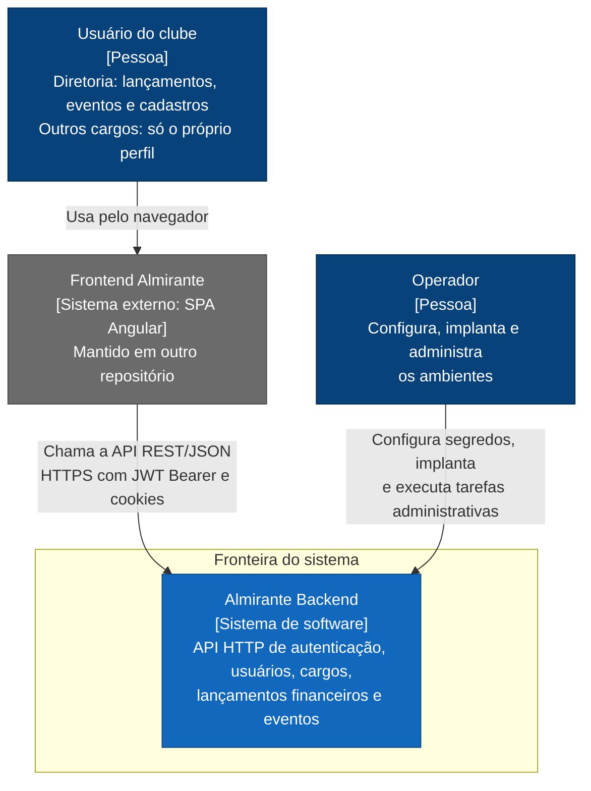

# C4: contexto do sistema

Este documento mostra o Almirante Backend como uma caixa só: quem o usa e com quais sistemas ele se
relaciona. É o nível 1 do modelo C4 (System Context). Os containers internos (nginx, API, SQL Server)
estão em [`c4-container.md`](c4-container.md).

Retrato do commit `57f24dd` da `main`, levantado em 2026-09-23. Veja como manter este documento
atualizado em [`README.md`](README.md#como-manter-a-documentação-atualizada).

## Diagrama

Legenda: o tipo de cada elemento aparece entre colchetes. Pessoas em azul-escuro, o sistema
documentado em azul e sistemas externos em cinza.

## Elementos

| Elemento | Tipo | Descrição | Evidência |
| --- | --- | --- | --- |
| Almirante Backend | Sistema de software | API HTTP que centraliza autenticação, usuários, cargos, lançamentos financeiros e eventos com cobrança por membro. Inclui o reverse proxy, a API e o banco (ver [`c4-container.md`](c4-container.md)). | [`README.md`](../../README.md), [`backend/`](../../backend) |
| Frontend Almirante | Sistema externo | SPA Angular mantida em outro repositório. É o cliente da API usado pelos usuários. | [`docs/authentication-security.md`](../authentication-security.md#contrato-da-spa-e-csrf), `Cors:AllowedOrigins` em [`Program.cs`](../../backend/Almirante.Api/Program.cs) e [`appsettings.json`](../../backend/Almirante.Api/appsettings.json), PR #1 |
| Usuário do clube | Pessoa | Usuário cadastrado, com um cargo ativo. Cargos `ADM`, `DIR`, `DIRA`, `SEC` e `TES` (diretoria) acessam lançamentos, eventos, usuários e cargos. Os demais cargos autenticam e consultam apenas o próprio perfil (`GET /api/Auth/Me`). | [`Roles.cs`](../../backend/Almirante.Api/Security/Roles.cs), policies em [`Program.cs`](../../backend/Almirante.Api/Program.cs), [`AuthorizationTests.cs`](../../backend/Almirante.Api.Tests/AuthorizationTests.cs) |
| Operador | Pessoa | Quem mantém os ambientes. Define segredos no `.env` ou em user-secrets, publica por push em `develop`, executa o bootstrap SQL, usa a CLI `reset-admin-password` e, opcionalmente, cria a identidade de consulta `adm-ti`. | [`README.md`](../../README.md), [`AdminPasswordResetCli.cs`](../../backend/Almirante.Api/Cli/AdminPasswordResetCli.cs), [`docs/sql/`](../sql), [`backend-deploy.yml`](../../.github/workflows/backend-deploy.yml) |

## Relações

| De | Para | Descrição | Evidência |
| --- | --- | --- | --- |
| Usuário do clube | Frontend Almirante | Usa a aplicação no navegador. | [`docs/authentication-security.md`](../authentication-security.md#contrato-da-spa-e-csrf) |
| Frontend Almirante | Almirante Backend | Chama a API REST/JSON por HTTPS. Envia o access token em `Authorization: Bearer` e usa cookies para refresh token e CSRF, com CORS por credenciais. | [`AuthController.cs`](../../backend/Almirante.Api/Controllers/AuthController.cs), [`Program.cs`](../../backend/Almirante.Api/Program.cs) (`AddCors`, `AddAntiforgery`), [ADR-0001](adr/0001-usar-jwt-com-sessoes-persistidas-e-refresh-rotativo.md) |
| Operador | Almirante Backend | Configura segredos e ambiente, implanta e executa tarefas administrativas (bootstrap SQL, reset de senha do administrador, consultas de TI). | [`compose.yaml`](../../compose.yaml), [`.env.example`](../../.env.example), [`scripts/sql-bootstrap.sh`](../../scripts/sql-bootstrap.sh), [ADR-0005](adr/0005-separar-identidades-sql-e-rotacionar-credenciais.md) |

## Fronteira do sistema

Dentro da fronteira ficam o nginx, a API ASP.NET Core, o SQL Server e o container de bootstrap SQL,
descritos em [`c4-container.md`](c4-container.md). O banco de dados pertence ao próprio sistema: nenhum
outro sistema versionado neste repositório acessa as tabelas. A consulta humana opcional pela
identidade `adm-ti` passa por views dedicadas do schema `ti`
([`docs/sql/criar-usuario-adm-ti.sql`](../sql/criar-usuario-adm-ti.sql)).

Fora da fronteira ficam o frontend (outro repositório) e as pessoas.

## O que não aparece neste diagrama e por quê

- **Integrações externas de runtime:** não existem. A API não chama serviços HTTP externos, não
  envia e-mail, não usa filas, cache distribuído, armazenamento de arquivos nem provedor de
  identidade externo. O código da API não usa `HttpClient`, e não há pacotes para esses fins nos
  `.csproj`.
- **Cadastro de usuários:** a API não expõe criação ou edição de usuários. Só o seed cria um usuário (o
  administrador inicial, em [`DbSeeder.cs`](../../backend/Almirante.Api/Data/DbSeeder.cs)). O
  repositório não mostra como os demais usuários são cadastrados nos ambientes.
- **GitHub Actions:** o CI e o deploy entregam o sistema, mas não participam do funcionamento em
  runtime. Estão descritos em [`c4-container.md`](c4-container.md#entrega-ci-e-deploy).
- **Plataforma de observabilidade:** a API é capaz de exportar telemetria por OTLP, mas nenhum destino
  está configurado nos ambientes versionados. O dashboard do Aspire só existe no desenvolvimento
  local ([ADR-0008](adr/0008-usar-aspire-no-desenvolvimento-e-opentelemetry-na-api.md)).
- **Clientes de desenvolvimento:** o Swagger UI (quando habilitado), o
  [`requests.http`](../../backend/Almirante.Api/requests.http) e os exemplos cURL de
  [`docs/local-login.md`](../local-login.md) usam o mesmo contrato HTTP do frontend.
